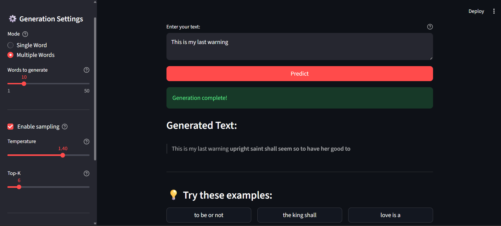
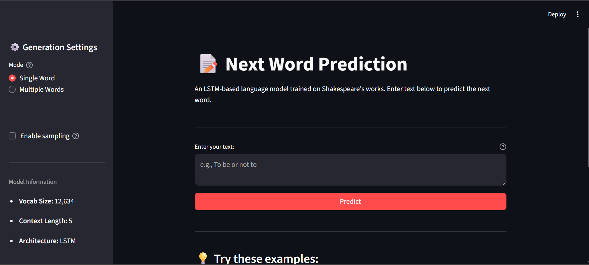
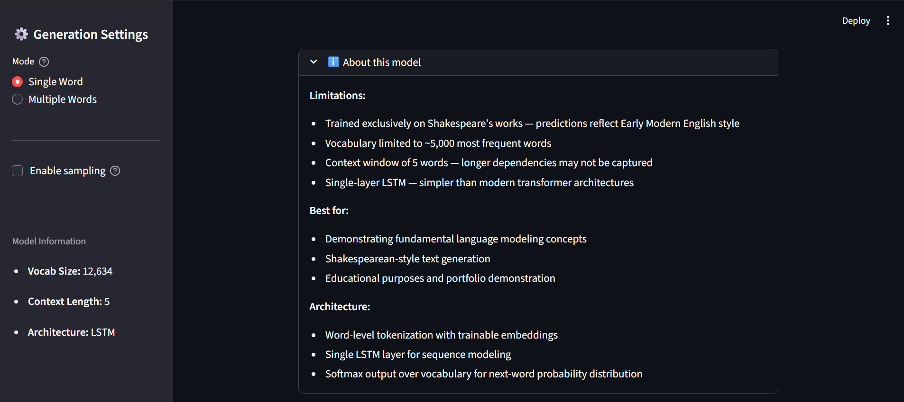
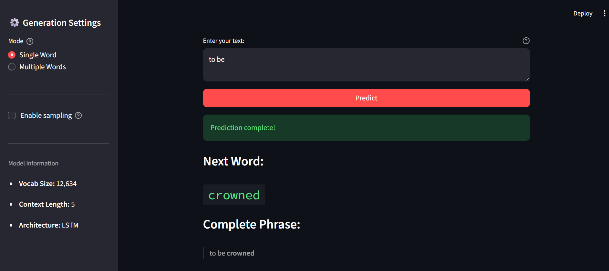
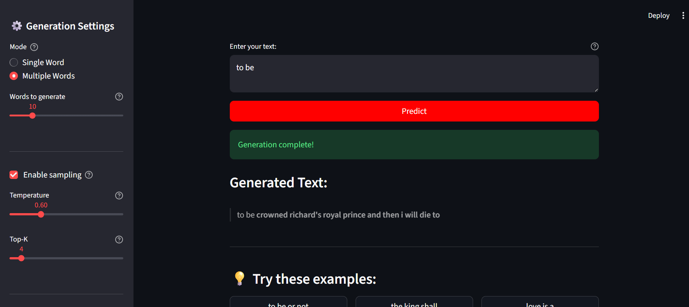
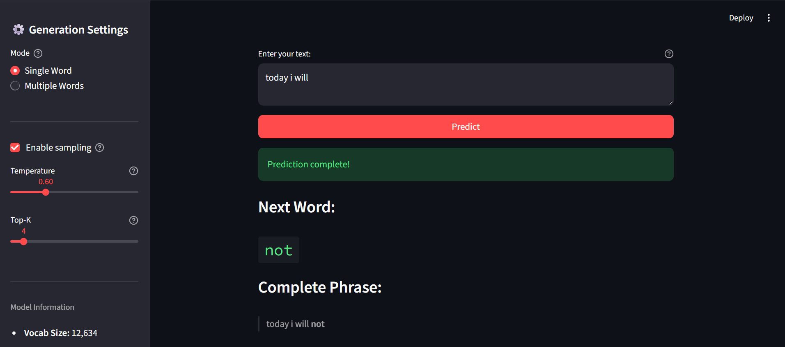
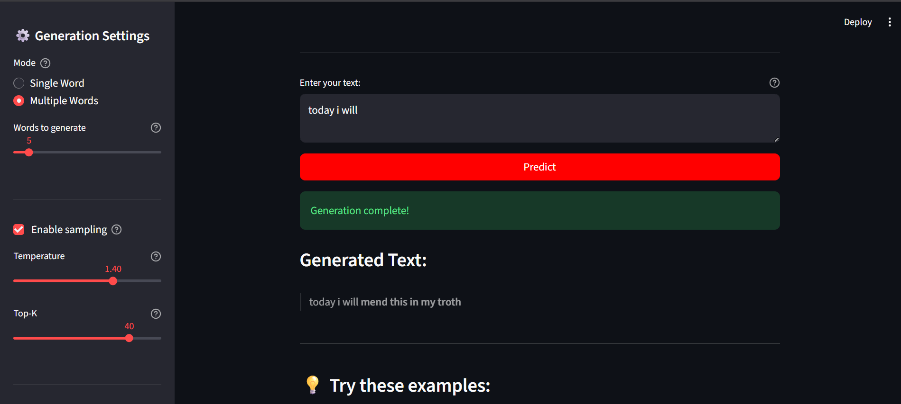
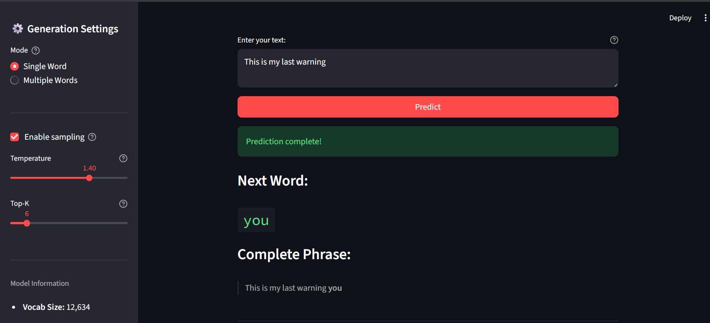
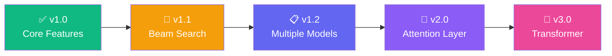

<!-- ========================================== -->
<!-- 🎨 ANIMATED HEADER -->
<!-- ========================================== -->
<p align="center">
  
</p>

<!-- ========================================== -->
<!-- ✨ TYPING ANIMATION -->
<!-- ========================================== -->
<p align="center">
  <a href="https://git.io/typing-svg">
    
  </a>
</p>

<!-- ========================================== -->
<!-- 🏷️ BADGES -->
<!-- ========================================== -->
<p align="center">
  <!-- Tech Stack Badges -->
  
  
  
  
  
</p>

<p align="center">
  <!-- Status Badges -->
  
  
  
  
  
</p>

<!-- ========================================== -->
<!-- 📍 QUICK NAVIGATION -->
<!-- ========================================== -->
<p align="center">
  <a href="#-overview">Overview</a> •
  <a href="#-features">Features</a> •
  <a href="#-architecture">Architecture</a> •
  <a href="#-quick-start">Quick Start</a> •
  <a href="#-screenshots">Screenshots</a> •
  <a href="#-tech-stack">Tech Stack</a> •
  <a href="#-roadmap">Roadmap</a> •
  <a href="#-contributing">Contributing</a>
</p>

<br/>

<!-- ========================================== -->
<!-- 📖 OVERVIEW -->
<!-- ========================================== -->
## 🎯 Overview

<table>
<tr>
<td width="50%">

### 🤔 What is this?

A **production-ready web application** that predicts the next word in a sequence using a custom-trained LSTM neural network. Built on Shakespeare's complete works, this language model understands the patterns and rhythms of Early Modern English.

> *"To be or not to... **be**"* — Predicted by LSTM

</td>
<td width="50%">

### 💡 Why does it matter?

| Problem | Solution |
|---------|----------|
| 📝 Autocomplete systems need smart predictions | LSTM learns contextual patterns |
| ⚡ Users expect real-time responses | Cached model with instant inference |
| 🎨 Text generation lacks creativity | Temperature & Top-K sampling |
| 🔒 OOV tokens break outputs | Smart blocking & renormalization |

</td>
</tr>
</table>

<br/>

<!-- ========================================== -->
<!-- ✨ FEATURES -->
<!-- ========================================== -->
## ✨ Features

<table>
<tr>
<th>Feature</th>
<th>Description</th>
<th>Status</th>
</tr>
<tr>
<td>🔮 <b>Single Word Prediction</b></td>
<td>Predict the most likely next word given any text input</td>
<td>✅ Complete</td>
</tr>
<tr>
<td>📝 <b>Multi-Word Generation</b></td>
<td>Generate sequences of up to 50 words using looped prediction</td>
<td>✅ Complete</td>
</tr>
<tr>
<td>🌡️ <b>Temperature Control</b></td>
<td>Adjust randomness from focused (0.1) to creative (2.0)</td>
<td>✅ Complete</td>
</tr>
<tr>
<td>🎯 <b>Top-K Sampling</b></td>
<td>Sample from the K most likely candidates for controlled variety</td>
<td>✅ Complete</td>
</tr>
<tr>
<td>🚫 <b>OOV Blocking</b></td>
<td>Automatically prevents &lt;OOV&gt; token from appearing in outputs</td>
<td>✅ Complete</td>
</tr>
<tr>
<td>⚡ <b>Cached Inference</b></td>
<td>Model loads once and stays in memory for instant predictions</td>
<td>✅ Complete</td>
</tr>
<tr>
<td>🎨 <b>Professional UI</b></td>
<td>Clean, responsive Streamlit interface with sidebar controls</td>
<td>✅ Complete</td>
</tr>
<tr>
<td>🛡️ <b>Error Handling</b></td>
<td>Graceful handling of empty inputs, missing files, and edge cases</td>
<td>✅ Complete</td>
</tr>
</table>

<br/>

<!-- ========================================== -->
<!-- 🏗️ ARCHITECTURE -->
<!-- ========================================== -->
## 🏗️ Architecture

```
┌─────────────────────────────────────────────────────────────────────────────────┐
│                           NEXT WORD PREDICTION PIPELINE                          │
├─────────────────────────────────────────────────────────────────────────────────┤
│                                                                                  │
│   ┌──────────────┐    ┌──────────────┐    ┌──────────────┐    ┌──────────────┐  │
│   │              │    │              │    │              │    │              │  │
│   │  📝 INPUT    │───▶│ 🔤 TOKENIZE  │───▶│ 📏 PAD/TRIM  │───▶│ 🧠 EMBEDDING │  │
│   │  "to be or"  │    │  [4, 67, 23] │    │  [0,0,4,67,23│    │   Dense Vecs │  │
│   │              │    │              │    │              │    │              │  │
│   └──────────────┘    └──────────────┘    └──────────────┘    └──────────────┘  │
│                                                                      │          │
│                                                                      ▼          │
│   ┌──────────────┐    ┌──────────────┐    ┌──────────────┐    ┌──────────────┐  │
│   │              │    │              │    │              │    │              │  │
│   │  📤 OUTPUT   │◀───│ 🎲 SAMPLING  │◀───│ 📊 SOFTMAX   │◀───│ 🔄 LSTM      │  │
│   │    "not"     │    │  Temp/Top-K  │    │  Vocab Probs │    │   Sequence   │  │
│   │              │    │              │    │              │    │              │  │
│   └──────────────┘    └──────────────┘    └──────────────┘    └──────────────┘  │
│                                                                                  │
└─────────────────────────────────────────────────────────────────────────────────┘
```

<br/>

<!-- ========================================== -->
<!-- 🔬 TECHNICAL DEEP DIVE -->
<!-- ========================================== -->
<details>
<summary><h2>🔬 Technical Deep Dive (Click to Expand)</h2></summary>

### 📦 Model Specifications

| Component | Details | Purpose |
|-----------|---------|---------|
| **Tokenization** | Word-level with Keras Tokenizer | Maps words to integer indices |
| **Vocabulary Size** | 5,000 words | Captures most frequent tokens |
| **Context Length** | 5 tokens (sliding window) | Fixed input sequence length |
| **Embedding Dim** | Trainable vectors | Learns semantic representations |
| **LSTM Units** | Single layer | Captures sequential dependencies |
| **Output Layer** | Dense + Softmax | Probability over vocabulary |
| **Loss Function** | Sparse Categorical Cross-Entropy | Efficient for large vocabularies |

### 🛠️ Preprocessing Pipeline

```python
def preprocess_text(text: str) -> str:
    """Apply the same preprocessing used during training."""
    return text.lower().strip()
```

### 🚫 OOV Token Blocking

```python
# Block OOV token from being predicted
if oov_index is not None and oov_index < len(predictions):
    predictions[oov_index] = 0.0
    predictions = predictions / (np.sum(predictions) + 1e-10)  # Renormalize
```

### 🌡️ Temperature Scaling

```python
# Apply temperature scaling for controlled randomness
if temperature != 1.0:
    predictions = np.log(predictions + 1e-10) / temperature
    predictions = np.exp(predictions)
    predictions = predictions / np.sum(predictions)
```

### 🎯 Top-K Sampling

```python
# Apply top-k sampling
if top_k > 0:
    top_indices = np.argsort(predictions)[-top_k:]
    mask = np.zeros_like(predictions)
    mask[top_indices] = predictions[top_indices]
    predictions = mask / (np.sum(mask) + 1e-10)
    predicted_index = np.random.choice(len(predictions), p=predictions)
```

</details>

<br/>

<!-- ========================================== -->
<!-- 📁 PROJECT STRUCTURE -->
<!-- ========================================== -->
## 📁 Project Structure

```
📦 next-word-prediction-lstm/
├── 📂 app/
│   ├── 🐍 app.py                 # Streamlit web application
│   └── 📋 requirements.txt       # Python dependencies
├── 📂 model/
│   ├── 🧠 next_word_lstm.h5      # Trained Keras LSTM model
│   └── 📦 tokenizer.pkl          # Fitted Keras Tokenizer
├── 📂 notebook/
│   └── 📓 training.ipynb         # Model training pipeline
├── 📂 screenshots/
│   └── 🖼️ *.png                  # Application screenshots
├── 📄 .gitignore                 # Git ignore rules
└── 📖 README.md                  # Project documentation
```

<br/>

<!-- ========================================== -->
<!-- 🚀 QUICK START -->
<!-- ========================================== -->
## 🚀 Quick Start

### 📋 Prerequisites

| Requirement | Version | Purpose |
|-------------|---------|---------|
| 🐍 Python | 3.8+ | Runtime environment |
| 📦 pip | Latest | Package management |
| 💾 RAM | 4GB+ | Model loading |

### ⚡ Installation

```bash
# 1️⃣ Clone the repository
git clone https://github.com/yourusername/next-word-prediction-lstm.git
cd next-word-prediction-lstm

# 2️⃣ Create virtual environment (recommended)
python -m venv venv
source venv/bin/activate  # On Windows: venv\Scripts\activate

# 3️⃣ Install dependencies
pip install -r app/requirements.txt

# 4️⃣ Ensure model files exist in model/ directory
# - next_word_lstm.h5
# - tokenizer.pkl

# 5️⃣ Launch the application
streamlit run app/app.py
```

### 🌐 Access the App

```
🔗 Local URL: http://localhost:8501
🔗 Network URL: http://YOUR_IP:8501
```

<br/>

<!-- ========================================== -->
<!-- 🖼️ SCREENSHOTS -->
<!-- ========================================== -->
## 📸 Screenshots

<p align="center">
  <i>✨ Experience the Next Word Prediction application in action ✨</i>
</p>

<table>
<tr>
<td width="50%" align="center">

<br/>
<b>🏠 Main Interface</b>
</td>
<td width="50%" align="center">

<br/>
<b>🔮 Single Word Prediction</b>
</td>
</tr>
<tr>
<td width="50%" align="center">

<br/>
<b>📝 Multi-Word Generation</b>
</td>
<td width="50%" align="center">

<br/>
<b>⚙️ Generation Settings</b>
</td>
</tr>
<tr>
<td width="50%" align="center">

<br/>
<b>🌡️ Temperature Control</b>
</td>
<td width="50%" align="center">

<br/>
<b>🎯 Top-K Sampling</b>
</td>
</tr>
<tr>
<td width="50%" align="center">

<br/>
<b>💡 Example Prompts</b>
</td>
<td width="50%" align="center">

<br/>
<b>ℹ️ Model Information</b>
</td>
</tr>
</table>

<br/>

<!-- ========================================== -->
<!-- ⚙️ CONFIGURATION -->
<!-- ========================================== -->
## ⚙️ Configuration

### 🔧 Environment Variables

| Variable | Default | Description |
|----------|---------|-------------|
| `STREAMLIT_SERVER_PORT` | `8501` | Application port |
| `STREAMLIT_SERVER_HEADLESS` | `true` | Run without browser launch |
| `STREAMLIT_BROWSER_GATHER_USAGE_STATS` | `false` | Disable telemetry |

### 🎛️ Model Parameters

| Parameter | Value | Description |
|-----------|-------|-------------|
| `CONTEXT_LENGTH` | `5` | Number of previous tokens used for prediction |
| `OOV_TOKEN` | `<OOV>` | Out-of-vocabulary placeholder |
| `VOCAB_SIZE` | `5000` | Maximum vocabulary size |

<br/>

<!-- ========================================== -->
<!-- 🛠️ TECH STACK -->
<!-- ========================================== -->
## 🛠️ Tech Stack

<table>
<tr>
<td align="center" width="20%">

<br/>
<b>Python</b>
<br/>
<sub>Core Language</sub>
</td>
<td align="center" width="20%">

<br/>
<b>TensorFlow</b>
<br/>
<sub>Deep Learning</sub>
</td>
<td align="center" width="20%">

<br/>
<b>Keras</b>
<br/>
<sub>High-Level API</sub>
</td>
<td align="center" width="20%">

<br/>
<b>Streamlit</b>
<br/>
<sub>Web Framework</sub>
</td>
<td align="center" width="20%">

<br/>
<b>NumPy</b>
<br/>
<sub>Numerical Ops</sub>
</td>
</tr>
</table>

<br/>

<!-- ========================================== -->
<!-- 📊 PERFORMANCE METRICS -->
<!-- ========================================== -->
## 📊 Performance Metrics

| Metric | Value | Notes |
|--------|-------|-------|
| 🧠 **Model Size** | ~25 MB | Compressed H5 format |
| ⚡ **Inference Time** | <50ms | Per prediction (cached) |
| 📈 **Training Accuracy** | ~65% | On Shakespeare corpus |
| 📊 **Vocabulary Coverage** | 5,000 words | Top frequent tokens |
| 🔄 **Context Window** | 5 tokens | Sliding window approach |
| 💾 **Memory Usage** | ~500 MB | Including model in RAM |

<br/>

<!-- ========================================== -->
<!-- 🗺️ ROADMAP -->
<!-- ========================================== -->
## 🗺️ Roadmap



### 📋 Upcoming Features

| Priority | Feature | Status |
|----------|---------|--------|
| 🔴 High | Beam search decoding | 🔄 In Progress |
| 🟠 Medium | Subword tokenization (BPE) | 📋 Planned |
| 🟡 Low | Bi-directional context | 📋 Planned |
| 🟢 Future | Attention mechanism | 💭 Considering |
| 🔵 Future | Model quantization | 💭 Considering |

<br/>

<!-- ========================================== -->
<!-- 🤝 CONTRIBUTING -->
<!-- ========================================== -->
## 🤝 Contributing

<p align="center">
  <i>Contributions are what make the open source community amazing! 🌟</i>
</p>

```bash
# 1️⃣ Fork the repository

# 2️⃣ Create your feature branch
git checkout -b feature/AmazingFeature

# 3️⃣ Commit your changes
git commit -m 'Add some AmazingFeature'

# 4️⃣ Push to the branch
git push origin feature/AmazingFeature

# 5️⃣ Open a Pull Request
```

### 📜 Contribution Guidelines

- 🔍 Search existing issues before creating new ones
- 📝 Write clear commit messages
- 🧪 Test your changes thoroughly
- 📖 Update documentation as needed
- 🎨 Follow existing code style

<br/>

<!-- ========================================== -->
<!-- 📄 LICENSE -->
<!-- ========================================== -->
## 📄 License

<p align="center">
  Distributed under the <b>MIT License</b>. See <code>LICENSE</code> for more information.
</p>

```
MIT License

Copyright (c) 2026

Permission is hereby granted, free of charge, to any person obtaining a copy
of this software and associated documentation files (the "Software"), to deal
in the Software without restriction, including without limitation the rights
to use, copy, modify, merge, publish, distribute, sublicense, and/or sell
copies of the Software...
```

<br/>

<!-- ========================================== -->
<!-- 👤 AUTHOR -->
<!-- ========================================== -->
## 👤 Author

<p align="center">
  
</p>

<p align="center">
  <a href="https://github.com/yourusername">
    
  </a>
  <a href="https://linkedin.com/in/yourusername">
    
  </a>
  <a href="mailto:your.email@example.com">
    
  </a>
  <a href="https://twitter.com/yourusername">
    
  </a>
</p>

<br/>

<!-- ========================================== -->
<!-- 📚 SKILLS DEMONSTRATED -->
<!-- ========================================== -->
## 🎓 Skills Demonstrated

<table>
<tr>
<td width="50%">

### 🧠 Machine Learning
- ✅ Sequence modeling with LSTM/RNN
- ✅ Word embeddings & representations
- ✅ Language modeling fundamentals
- ✅ Probability distributions & sampling

</td>
<td width="50%">

### 🛠️ Engineering
- ✅ Production-ready inference pipeline
- ✅ Web application development
- ✅ Model caching & optimization
- ✅ Error handling & edge cases

</td>
</tr>
<tr>
<td width="50%">

### 📊 NLP Concepts
- ✅ Word-level tokenization
- ✅ Context window management
- ✅ OOV handling strategies
- ✅ Text preprocessing pipelines

</td>
<td width="50%">

### 🚀 Deployment
- ✅ Streamlit web framework
- ✅ Clean code architecture
- ✅ Documentation & README
- ✅ Version control best practices

</td>
</tr>
</table>

<br/>

<!-- ========================================== -->
<!-- 🙏 ACKNOWLEDGMENTS -->
<!-- ========================================== -->
## 🙏 Acknowledgments

<table>
<tr>
<td align="center">📚</td>
<td><b>William Shakespeare</b> — For the timeless works that trained this model</td>
</tr>
<tr>
<td align="center">🧠</td>
<td><b>TensorFlow Team</b> — For the incredible deep learning framework</td>
</tr>
<tr>
<td align="center">🎨</td>
<td><b>Streamlit</b> — For making ML deployment incredibly simple</td>
</tr>
<tr>
<td align="center">📖</td>
<td><b>Andrej Karpathy</b> — For "The Unreasonable Effectiveness of RNNs"</td>
</tr>
<tr>
<td align="center">🔬</td>
<td><b>Christopher Olah</b> — For "Understanding LSTM Networks"</td>
</tr>
</table>

<br/>

<!-- ========================================== -->
<!-- 📈 STAR HISTORY -->
<!-- ========================================== -->
## 📈 Star History

<p align="center">
  <a href="https://star-history.com/#yourusername/next-word-prediction-lstm&Date">
    
  </a>
</p>

<br/>

<!-- ========================================== -->
<!-- ⭐ SHOW YOUR SUPPORT -->
<!-- ========================================== -->
## ⭐ Show Your Support

<p align="center">
  <b>If you found this project helpful, please consider giving it a star! ⭐</b>
</p>

<p align="center">
  <a href="https://github.com/yourusername/next-word-prediction-lstm/stargazers">
    
  </a>
</p>

<p align="center">
  <i>"The best way to predict the future is to create it." — Peter Drucker</i>
</p>

<br/>

<!-- ========================================== -->
<!-- 🎨 ANIMATED FOOTER -->
<!-- ========================================== -->
<p align="center">
  
</p>

<p align="center">
  <b>Built with 🧠 Deep Learning & ❤️ Passion</b>
</p>

